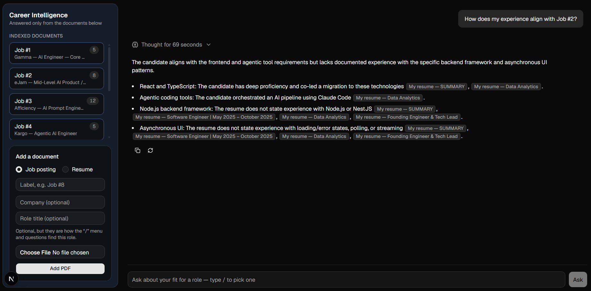
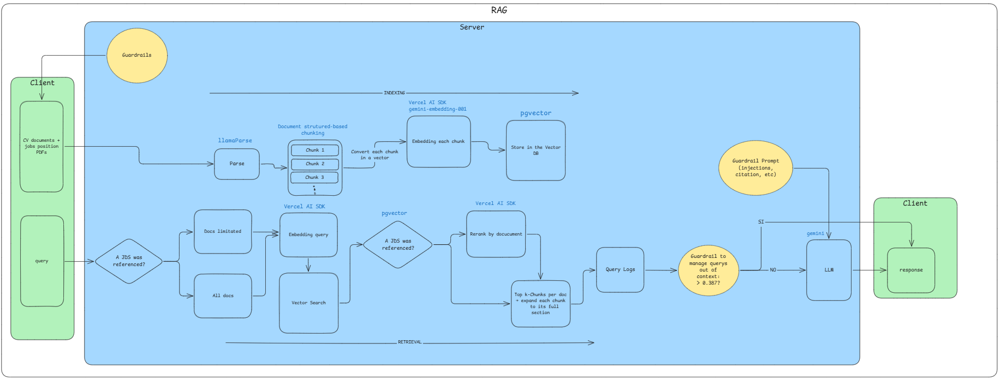

# Career Intelligence Assistant



a.	Quick setup instructions

Node 22+, pnpm, Docker.

### 1. Database
```bash
docker compose up -d
```
Postgres 17 + pgvector. `db/schema.sql` runs on first boot only.
Ports 5432/5433 are often taken by a local Postgres, so the container binds **5544**.

### 2. Environment
```bash
cp .env.example .env
```
Fill in:

| key | where from | needed for |
| --- | --- | --- |
| `GOOGLE_GENERATIVE_AI_API_KEY` | aistudio.google.com/apikey | embeddings + chat |
| `LLAMA_CLOUD_API_KEY` | cloud.llamaindex.ai | PDF parsing + extraction |
| `COHERE_API_KEY` | dashboard.cohere.com/api-keys | reranking |

### 3. Run
```bash
pnpm install
pnpm dev            # http://localhost:3000
```

Upload a resume and one or more job postings from the UI.

### 4. After ingesting postings
```bash
docker compose exec -T db psql -U postgres -d career_intel < db/identities.sql
```
Ingest does not fill `company` / `role_title`, and without them a posting only
answers to `Job #N` instead of to its real name.

### Optional
```bash
pnpm test                          # 63 tests, no network, no db, no model
pnpm retrieve --chunks "<q>"       # what a question retrieves and why
pnpm eval                          # retrieval eval over eval/questions.json
pnpm answers --repeat=3            # generation eval, three passes
```

b.	Architecture overview (a simple diagram is great but not required)
[](Architecture-overview.png)

c.	What would be required to productionize your solution, make it scalable and deploy it on a hyper-scaler such as AWS / GCP / Azure / Cloudflare?
About productorize, the app already run in docker of 212 MB and all the state lives in Postgres. This makes it straightforward to deploy the same container to a service such as Google Cloud Run, AWS ECS, or AWS App Runner, backed by a managed PostgreSQL instance with pgvector enabled.
To make the solution production-ready and scalable, I would add multi-tenancy so multiple users can independently manage their own CVs, job descriptions, and embeddings. Each record would be associated with a tenant_id, with database-level isolation (e.g., PostgreSQL Row-Level Security) to ensure users can only access their own data.
For the LLM, embedding, and reranking providers, I would move from free tiers to paid API plans and implement per-user usage limits and quotas. This would help control infrastructure and API costs while preventing a single user from consuming disproportionate resources.

d.	RAG/LLM approach & decisions: Choices considered and final choice for LLM / embedding model / vector database / orchestration framework, prompt & context management, guardrails, quality, observability

## Choise considered:
- LLM : Claude haiku, chatgpt-4o, ollama models.
- embedding mode: openai/text-embedding-3-small, gemini emebeddings
- vector database: Postgres - pgvector, Supabase
- orchestation framework: Vercel AI SDK
- prompt & context management: I use a single system prompt for the LLM generation. The context is managed by the docs level when i select the top k-chunks, also there is a parent-child structure so every chunk is referenced by the document that it belongs. Each chunk its like a section of the docs, so there would be cases where a chunk exceed the max of tokens, in that case the section will be cut at the middle, but the chunk will store the section that it belongs and in the top k-chunks i always expand the chunks to looking for any other chunk to avoid lose context.
- guardrails: Just one CV allowed(to avoid cross information), system prompt validation(never fill the answer with general information, cite every response).  
- quality: 
    - Recall@K
    - Precision@K
    - hallucinations management
    - Reranking active only with is an scoped question.
    - Retrieval eval (evidence recall 36/47, document precision 81.6%)
    - Answer(Genration) eval run 3 times, scoring 42-43 of 46
    - 0 invedted citations
- observability: i manage a `pnpm eval`(for retrieval, see the chunks retrieved) and `pnpm answers`(for generation, to see the output for the LLM). For that I have a 'query_logs' that saves each query with its scope, how many sections it retrieved, the closest distance, the document scatter, and whether the guardrail let it through.

## Final choise:
- LLM: gemma
- embedding mode: gemini-embedding-001
- vector database: Postgres - pgvector
- orchestation framework: Vercel AI SDK
- prompt & context management: I use a single system prompt for the LLM generation. The context is managed by the docs level when i select the top k-chunks, also there is a parent-child structure so every chunk is referenced by the document that it belongs. Each chunk its like a section of the docs, so there would be cases where a chunk exceed the max of tokens, in that case the section will be cut at the middle, but the chunk will store the section that it belongs and in the top k-chunks i always expand the chunks to looking for any other chunk to avoid lose context.
- guardrails: Query Distance to avoid out of context questions, just one CV allowed(to avoid cross information), system prompt validation(never fill the answer with general information, cite every response, injections, the question is ).
- quality: Recall@K, Precision@K, 0 hallucinations. Reranking 
- observability: I have a 'query_logs'(query by real users and saved in Postgres) that saves each query with its scope, how many sections it retrieved, the closest distance, the document scatter, and whether the guardrail let it through. Then, i manage , `pnpm eval`(for retrieval, see the chunks retrieved) and `pnpm answers`(for generation, to see the output for the LLM).

e.	Key technical decisions you made and why
Pdf is the common format to upload CVs and many other documents, is the standart. But, pdf is a layout and it cannot be managed as a simple plain text, therefore before start the chunking process i had to add an step zero, this was to add a llama-Extract, i define a structured schema to retreive the fields that i will need to manage the data from the pdf.

Then, for the chunking process i decide to use document structured-based chunking because a CV and JBs are divided by headers, sections, subsection and bullets, and this chunking method can divide it very well without cut the info in the middle. However, what happened if i ask for years of experience? how the LLM knows if i am talking about the JDs or my CV? so to solve that problem i decided to structure the metadata of the chunk as a tree(parents and childs), so the LLM will know where these chunks came from. Important to keep the context and improve the accuracy.

Another key technical desicion was about the management of the input query. Because the query might be ambiguos, broad or just need more than one document to get a good response. So i divided that in 2 sections:
- If the question is scoped, i mean, the person mention any reference of the document in the query, i limitate the chunks to the documents referenced + CV. Then i take the top K-chunks of the documents and rerank them to catch the best chunks and avoid lose key information.
- If the question is so wide or general, i search by all the documents, then select the top K-chunks and all of them go to the LLM. I measured the rerank in this case but the trade-off was bad. 

f.	Engineering standards you’ve followed (and maybe some that you skipped)
- Strict Typescript
- Transaction method when i upload a document.
- The rules about scope, guardrails and cites are in files away from the DB, so we can test them without turn on anything.
- Cache evaluation dont allowed to run it if the corpus has changed, this is to avoid compare old results.
- Propt in only one file so the tests and the app can reuse it.

g.	How you used AI tools in your development process
First of all, i have to put the AI in context. Then i mentioned the tech stack that i am going to use and also i pasted my RAG architecture that i designed so it can understand better the idea of the solution. Then i discuss about if it see any gap in the workflow. So if he propose any stack or technology to use, i would first research it to understand this apporach and also the scalalbility.

After that i like to divide my work into tasks or phases(Planning mode), each phase can contain from the step-0 to the final one. Each part of the development i use skills to review the code with Typechek and also to find for the laziest solution(ponytail) in terms of code. To get a clean approach without a lot of lines of code.

I always update the context of the AI to avoid too large context windows and lose quality in the response. Each part of the code that it generate i reviewed to check if the logic works, if not i iterate until get a good apprach. Also i work with 2 windows, so in the first one i have the chat where i make the development and the other one is to have a clean context so any of them knows what each other does, this is useful to have responses non influenciated by others.

h.	What you'd do differently with more time
Improve the query: I will implement RAG Fusion to generate multiple similar queries based on the main query. Each generated query explores different formulations and perspectives of the user's intent. This would increase the probability of retrieving relevant chunks that might not be retrieved with the original query alone.
I would also combine multi-query retrieval with hybrid search (vector + keyword search). While semantic search is effective at capturing the meaning of a query, keyword search can help retrieve documents containing specific terms, technologies, company names, or other exact matches that may be important for the user's query. Combining both approaches would improve retrieval coverage and robustness.

